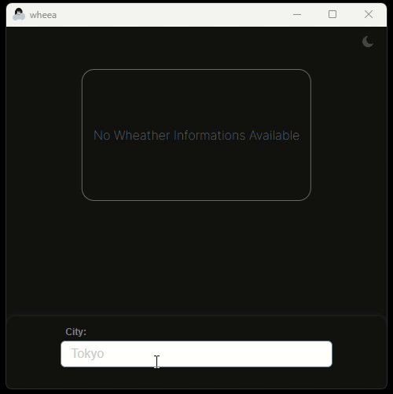

    

 
 

# Wheea

Wheea is Desktop App for fetching wheather informations. Its built using [Wails](https://wails.io/) framework for creating desktop apps using Web Techs.

## How to use it

Simply, type the city name you want to fetch in the search field, and done.

## Demo

## Requirements
**Go:** 1.22

**NodeJS:** 21.3.0

*Obs:* Some lower versions may also work.

## Getting Started
`go mod tidy`

`cd frontend && npm install`

`go install github.com/wailsapp/wails/v2/cmd/wails@latest`

*At project's root dir, run:* **wails dev**

## Assets
Icons and illustrations from [iconfinder](https://www.iconfinder.com/) by *[Laura Reen](https://www.iconfinder.com/search?designer=laurareen)*.

## API
 Wheea uses free api for geocoding and weather query provided by [open-meteo](https://open-meteo.com/). Currently, they give **10.000** requests for free.

## Stack
 - *[Svelte](https://svelte.dev/)*;
 - *[sweetalert2](https://sweetalert2.github.io/)*;
 - *[Wails](https://wails.io/)*;
